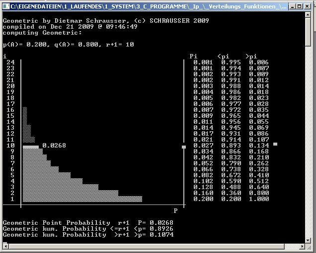
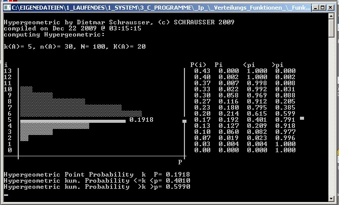
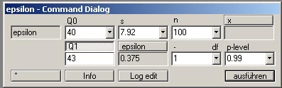
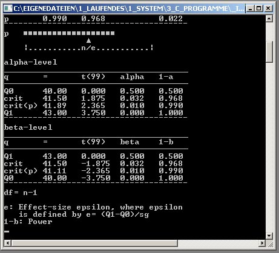

# FunktionWin

Graphical MS Windows user interface for `ConsoleApp_DistributionFunctions` (Schrausser, 2024b).  

The following functions were realized:

### Wahrscheinlichkeits-Verteilung (probability distribution)

- Binomial-Funktion $f(X=k|n)$  
- Poisson-Funktion $f(X=k|n,p)$  
- Geometrische-Funktion $f(X=r|p)$  
- Hypergeometrische-Funktion $f(X=k|n,K,N)$  
- Exakt binomialer 2-Felder Test $f(X=b|b,c)$  
- Exakt hypergeometrischer 4-Felder Test $f(X=a|a,b,c,d)$, *Fisher Exact* (Fisher, 1922, 1954; s. Agresti, 1992).  

#### Screenshots probability distribution

The fundamental *binomial distribution* was derived by Bernoulli (1713), s. Schneider (2005a) and above all De Moivre (1711, 1718) with the discovery of the first instance of central limit theorem, to *approximate* the *binomial* distribution with the *normal* distribution, further developed by Gauss (1809, 1823), see Hahn (1970), Hald (1990) or Schneider (2005b).

### Theta-Verteilung $\theta$ (characteristic value or $\theta$ distribution)
- z-Dichte Funktion $f(x=z)$  
- z-Funktion $F(x=z)$  
- t-Funktion $F(x=t)$  
- $\chi$²- Funktion $F(x=\chi²)$  
- F- Funktion $F(x=F)$   
- Effekt-Stärke $\epsilon$, Cohen (1977). 

#### Screenshots $\epsilon$

The *t-distribution* was first derived by Lüroth (1876), later in a more general form defined as *Pearson Type IV* (Pearson, 1895), commonly known as *Student's t-distribution*, from William Sealy Gosset (1908).

Helmert (1876) first described the *chi squared distribution*, independently rediscovered by Pearson (1900), c.f. also Elderton (1902), Pearson (1914) or Plackett (1983), for the *F-distribution* by Fisher (1924) see Snedecor (1934) and Scheffé (1959).

Statistical *power* $1-\beta$ and *effect size* $\epsilon$  (Cohen, 1977, 1992) layed foundations for statistical meta-analysis and methods of estimation statistics, see e.g. Borenstein et al. (2001) for related software applications. 

### Transformationen (transformation functions)
- Fisher-Z Funktion $F(x=r)$, Fisher (1915).
- Gamma $F(x)=\Gamma$

*Gamma* $\Gamma$, to solve the problem of *extending* the *factorial* to *non-integer* arguments, was first considered in a letter from Bernoulli to Goldbach (Bernoulli, 1729), introduced later by Euler (1738) - of fundamental definitional importance for the formulation of *approximate probability distribution* functions such as $\chi$², $t$ or $F$ (c.f. Meyberg & Vachenauer, 2001; Cuyt et al., 2008; Beals & Wong, 2020; Little et al., 2022).

See further e.g. Bortz (1984), Bortz & Weber (2005), Bortz & Schuster (2010), Döring (2023), Pascucci (2024a, b) and Schrausser (2024a).

### References

Agresti, A. (1992). A Survey of Exact Inference for Contingency Tables. *Statistical Science 7* (1): 131–53. https://doi.org/10.1214/ss/1177011454.

Bernoulli, D. (1729). Lettre XLVII. D. Bernoulli a Goldbach. St.-Petersbourg ce 6. octobre 1729. https://commons.m.wikimedia.org/wiki/File:DanielBernoulliLetterToGoldbach-1729-10-06.jpg.

Bernoulli, J. (1713). *Ars conjectandi, opus posthumum. Accedit Tractatus de seriebus infinitis, et epistola gallicé scripta de ludo pilae reticularis*. Basileae: Impensis Thurnisiorum, Fratrum. https://www.e-rara.ch/zut/doi/10.3931/e-rara-9001.

Borenstein, M., Rothstein, H., Cohen, J., Schoenfeld, D., Berlin, J., & Lakatos, E. (2001). *Power and Precision: A Computer Program for Statistical Power Analysis and Confidence Intervals*. Englewood, NJ: Biostat, Inc. https://books.google.com/books?id=tYg02XZBeNAC&printsec=frontcover&hl=de#v=onepage&q&f=false.

Cohen, J. (1977). *Statistical Power Analysis for the Behavioral Scienc*e. Amsterdam: Elsevier Academic Press. https://doi.org/10.1016/C2013-0-10517-X.

———. (1992). A Power Primer. *Psychological Bulletin 112* (1): 155–59. https://doi.org/10.1037/0033-2909.112.1.15.

de Moivre, A. (1711). De mensura sortis, seu, de probabilitate eventuum in ludis a casu fortuito pendentibus. *Philosophical Transactions of the Royal Society of London 27* (329): 213–64. https://doi.org/10.1098/rstl.1710.0018.

———. (1718). *The Doctrine of Chances: Or, A Method of Calculating the Probability of Events in Play*. 1st ed. London: W. Pearson. https://books.google.com/books?id=3EPac6QpbuMC.

Elderton, W. P. (1902). Tables for Testing the Goodness of Fit of Theory to Observation. *Biometrika 1* (2): 155–63. https://doi.org/10.1093/biomet/1.2.155.

Euler, L. (1738). De progressionibus transcendentibus seu quarum termini generales algebraice dari nequeunt. *Commentarii Academiae Scientiarum Petropolitanae 5*: 36–57. https://scholarlycommons.pacific.edu/euler-works/19/.

Fisher, R. A. (1915). Frequency Distribution of the Values of the Correlation Coefficient in Samples from an Indefinitely Large Population. *Biometrika 10* (4): 507–21. https://doi.org/10.2307/2331838.

———.  (1922). On the Interpretation of χ2 from Contingency Tables, and the Calculation of p. *Journal of the Royal Statistical Society 85* (1): 87–94. https://doi.org/10.2307/2340521.

———. (1924). On a Distribution Yielding the Error Functions of Several Well-Known Statistics. *Proceedings International Mathematical Congress, Toronto 2*: 805–13. https://repository.rothamsted.ac.uk/item/8w2q9/on-a-distribution-yielding-the-error-functions-of-several-well-known-statistics.

———. (1954). *Statistical Methods for Research Workers*. 12th ed. Edinburgh: Oliver; Boyd. https://www.worldcat.org/de/title/statistical-methods-for-research-workers/oclc/312138.

Gauß, C. F. (1809). *Theoria motvs corporvm coelestivm in sectionibvs conicis Solem ambientivm*. Hambvrgi: Svmtibvs F. Perthes et I. H. Besser. https://archive.org/details/theoriamotuscor00gausgoog/page/n1/mode/1up.

———. (1823). *Theoria Combinationis Observationum Erroribus Minimis Obnoxiae*. Göttingen: apud Henricum Dieterich. https://doi.org/10.3931/e-rara-2857.

Gosset, W. S. (1908). The Probable Error of a Mean. *Biometrika 6* (1): 1–25. https://doi.org/10.2307/2331554.

Hahn, R. (1970). Mathematics - The Doctrine of Chances or, A Method of Calculating the Probabilities of Events in Play. By Abraham de Moivre. 2nd ed. [1738]. London, F. Cass, 1967. Pp. xiv + 258. £6 6s. *The British Journal for the History of Science 5* (2): 189–90. https://doi.org/10.1017/S0007087400010967.

Hald, A. (1990). De Moivre and the Doctrine of Chances, 1718, 1738, and 1756. In *History of Probability and Statistics and Their Applications before 1750*, edited by Hald, A., 397–424. New York: Wiley Series in Probability; Statistics, Wiley-Interscience. https://onlinelibrary.wiley.com/doi/book/10.1002/0471725161.

Agresti, A. (1992). A Survey of Exact Inference for Contingency Tables. *Statistical Science 7* (1): 131–53. https://doi.org/10.1214/ss/1177011454.

Beals, R., & Wong, R. S. C. (2020). The Gamma and Beta Functions. In *Explorations in Complex Functions*, 141–53. Cham: Springer International Publishing. https://doi.org/10.1007/978-3-030-54533-8_10.

Bernoulli, D. (1729). Lettre XLVII. D. Bernoulli a Goldbach. St.-Petersbourg ce 6. octobre 1729. https://commons.m.wikimedia.org/wiki/File:DanielBernoulliLetterToGoldbach-1729-10-06.jpg.

Bernoulli, J. (1713). *Ars conjectandi, opus posthumum. Accedit Tractatus de seriebus infinitis, et epistola gallicé scripta de ludo pilae reticularis*. Basileae: Impensis Thurnisiorum, Fratrum. https://www.e-rara.ch/zut/doi/10.3931/e-rara-9001.

Borenstein, M., Rothstein, H., Cohen, J., Schoenfeld, D., Berlin, J., & Lakatos, E. (2001). *Power and Precision: A Computer Program for Statistical Power Analysis and Confidence Intervals*. Englewood, NJ: Biostat, Inc. https://books.google.com/books?id=tYg02XZBeNAC&printsec=frontcover&hl=de#v=onepage&q&f=false.

Bortz, J. (1984). *Lehrbuch Der Empirischen Forschung*. Berlin, Heidelberg: Springer Berlin Heidelberg. https://doi.org/10.1007/978-3-662-00468-5.

Bortz, J., & Schuster, C. (2010). *Statistik Für Human- Und Sozialwissenschaftler: Limitierte Sonderausgabe*. 7th ed. Springer-Lehrbuch. Berlin, Heidelberg: Springer. https://doi.org/10.1007/978-3-642-12770-0.

Bortz, J., & Weber, R. (2005). *Statistik: Für Human- Und Sozialwissenschaftler*. 6th ed. Springer-Lehrbuch. Berlin, Heidelberg: Springer. https://doi.org/10.1007/b137571.

Cohen, J. (1977). *Statistical Power Analysis for the Behavioral Scienc*e. Amsterdam: Elsevier Academic Press. https://doi.org/10.1016/C2013-0-10517-X.

———. (1992). A Power Primer. *Psychological Bulletin 112* (1): 155–59. https://doi.org/10.1037/0033-2909.112.1.15.

Cuyt, A., Petersen, V. B., Verdonk, B., Waadeland, H., & Jones, W. B. (2008). Gamma Function and Related Functions. In *Handbook of Continued Fractions for Special Functions*, 221–51. Dordrecht: Springer Netherlands. https://doi.org/10.1007/978-1-4020-6949-9_12.

de Moivre, A. (1711). De mensura sortis, seu, de probabilitate eventuum in ludis a casu fortuito pendentibus. *Philosophical Transactions of the Royal Society of London 27* (329): 213–64. https://doi.org/10.1098/rstl.1710.0018.

———. (1718). *The Doctrine of Chances: Or, A Method of Calculating the Probability of Events in Play*. 1st ed. London: W. Pearson. https://books.google.com/books?id=3EPac6QpbuMC.

Döring, N. (2023). *Forschungsmethoden Und Evaluation in Den Sozial- Und Humanwissenschaften*. Berlin, Heidelberg: Springer Berlin Heidelberg. https://doi.org/10.1007/978-3-662-64762-2.

Elderton, W. P. (1902). Tables for Testing the Goodness of Fit of Theory to Observation. *Biometrika 1* (2): 155–63. https://doi.org/10.1093/biomet/1.2.155.

Euler, L. (1738). De progressionibus transcendentibus seu quarum termini generales algebraice dari nequeunt. *Commentarii Academiae Scientiarum Petropolitanae 5*: 36–57. https://scholarlycommons.pacific.edu/euler-works/19/.

Fisher, R. A. (1915). Frequency Distribution of the Values of the Correlation Coefficient in Samples from an Indefinitely Large Population. *Biometrika 10* (4): 507–21. https://doi.org/10.2307/2331838.

———.  (1922). On the Interpretation of χ2 from Contingency Tables, and the Calculation of p. *Journal of the Royal Statistical Society 85* (1): 87–94. https://doi.org/10.2307/2340521.

———. (1924). On a Distribution Yielding the Error Functions of Several Well-Known Statistics. *Proceedings International Mathematical Congress, Toronto 2*: 805–13. https://repository.rothamsted.ac.uk/item/8w2q9/on-a-distribution-yielding-the-error-functions-of-several-well-known-statistics.

———. (1954). *Statistical Methods for Research Workers*. 12th ed. Edinburgh: Oliver; Boyd. https://www.worldcat.org/de/title/statistical-methods-for-research-workers/oclc/312138.

Gauß, C. F. (1809). *Theoria motvs corporvm coelestivm in sectionibvs conicis Solem ambientivm*. Hambvrgi: Svmtibvs F. Perthes et I. H. Besser. https://archive.org/details/theoriamotuscor00gausgoog/page/n1/mode/1up.

———. (1823). *Theoria Combinationis Observationum Erroribus Minimis Obnoxiae*. Göttingen: apud Henricum Dieterich. https://doi.org/10.3931/e-rara-2857.

Gosset, W. S. (1908). The Probable Error of a Mean. *Biometrika 6* (1): 1–25. https://doi.org/10.2307/2331554.

Hahn, R. (1970). Mathematics - The Doctrine of Chances or, A Method of Calculating the Probabilities of Events in Play. By Abraham de Moivre. 2nd ed. [1738]. London, F. Cass, 1967. Pp. xiv + 258. £6 6s. *The British Journal for the History of Science 5* (2): 189–90. https://doi.org/10.1017/S0007087400010967.

Hald, A. (1990). De Moivre and the Doctrine of Chances, 1718, 1738, and 1756. In *History of Probability and Statistics and Their Applications before 1750*, edited by Hald, A., 397–424. New York: Wiley Series in Probability; Statistics, Wiley-Interscience. https://onlinelibrary.wiley.com/doi/book/10.1002/0471725161.

Helmert, F. R. (1876). Ueber Die Wahrscheinlichkeit Der Potenzsummen Der Beobachtungsfehler Und Über Einige Damit Im Zusammenhange Stehende Fragen. *Zeitschrift Für Mathematik Und Physik 21*: 192–219. https://gdz.sub.uni-goettingen.de/id/PPN599415665_0021.

Little, C. H. C., Teo, K. L., & van Brunt, B. (2022). The Gamma Function. In *An Introduction to Infinite Products*, 131–91. Cham: Springer International Publishing. https://doi.org/10.1007/978-3-030-90646-7_3.

Lüroth, J. (1876). Vergleichung von Zwei Werthen Des Wahrscheinlichen Fehlers. *Astronomische Nachrichten 87* (14): 209–20. https://doi.org/10.1002/asna.18760871402.

Meyberg, K., & Vachenauer, P. (2001). *Höhere Mathematik 1: Differential- und Integralrechnung Vektor- und Matrizenrechnung*. Berlin, Heidelberg: Springer Berlin Heidelberg. https://doi.org/10.1007/978-3-642-56654-7.

Pascucci, A. (2024a). *Probability Theory I. Random Variables and Distributions*. 1st ed. UNITEXT. Cham: Springer. https://doi.org/10.1007/978-3-031-63190-0.

———. (2024b). *Probability Theory II. Stochastic Calculus*. 1st ed. UNITEXT. Cham: Springer. https://doi.org/10.1007/978-3-031-63193-1.

Pearson, K. (1895). Contributions to the Mathematical Theory of Evolution. II. Skew Variation in Homogeneous Material. *Philosophical Transactions of the Royal Society A: Mathematical, Physical and Engineering Sciences 186*: 343–414. https://doi.org/10.1098/rsta.1895.0010.

———. (1900). X. On the criterion that a given system of deviations from the probable in the case of a correlated system of variables is such that it can be reasonably supposed to have arisen from random sampling. *The London, Edinburgh, and Dublin Philosophical Magazine and Journal of Science 50* (302): 157–75. https://doi.org/10.1080/14786440009463897.

———. (1914). On the Probability That Two Independent Distributions of Frequency Are Really Samples of the Same Population, with Special Reference to Recent Work on the Identity of Trypanosome Strains. *Biometrika 10*: 85–154. https://doi.org/10.1093/biomet/10.1.85.

Plackett, R. L. (1983). Karl Pearson and the Chi-Squared Test. *International Statistical Review / Revue Internationale de Statistique 51* (1): 59–72. https://doi.org/10.2307/1402731.

Scheffé, H. (1959). *The Analysis of Variance*. New York: Wiley. https://psycnet.apa.org/record/1961-00074-000.

Schneider, I. (2005a). Chapter 6 - Jakob Bernoulli, Ars conjectandi (1713). In *Landmark Writings in Western Mathematics 1640-1940*, edited by Grattan-Guinness, I., Cooke, R., Corry, L., Crépel, P., & Guicciardini, N., 88–104. Amsterdam: Elsevier Science. https://doi.org/10.1016/B978-044450871-3/50087-5.

———. (2005b). Chapter 7 -Abraham De Moivre, The Doctrine of Chances (1718, 1738, 1756). In *Landmark Writings in Western Mathematics 1640-1940*, edited by Grattan-Guinness, I., Cooke, R., Corry, L., Crépel, P., & Guicciardini, N., 105–20. Amsterdam: Elsevier Science. https://doi.org/10.1016/B978-044450871-3/50087-5.

Schrausser, D. G. (2024a). *Handbook: Distribution Functions (Verteilungs Funktionen)*. PsyArXiv. https://doi.org/10.31234/osf.io/rvzxa.

———. (2024b). *Schrausser/ConsoleApp_DistributionFunctions: Console applicationes for distribution functions* (version v1.5.0). Zenodo. https://doi.org/10.5281/zenodo.7664141.

Snedecor, G. W. (1934). *Calculation and Interpretation of Analysis of Variance and Covariance*. Ames, Iowa: Collegiate Press. https://doi.org/10.1037/13308-000.
