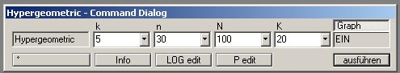

# FunktionWin

Graphical MS Windows user interface for `ConsoleApp_DistributionFunctions` (Schrausser, 2023).

### Screenshots

### References

Schrausser, D. G. (2023). *Schrausser/ConsoleApp_DistributionFunctions: Console applicationes for distribution functions* (v1.0.0). Zenodo. https://doi.org/10.5281/zenodo.7664141
